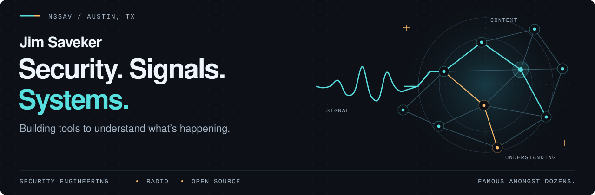
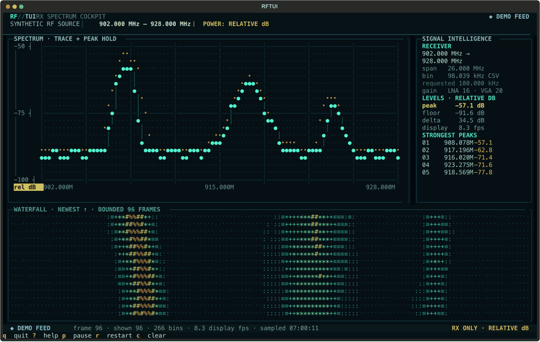
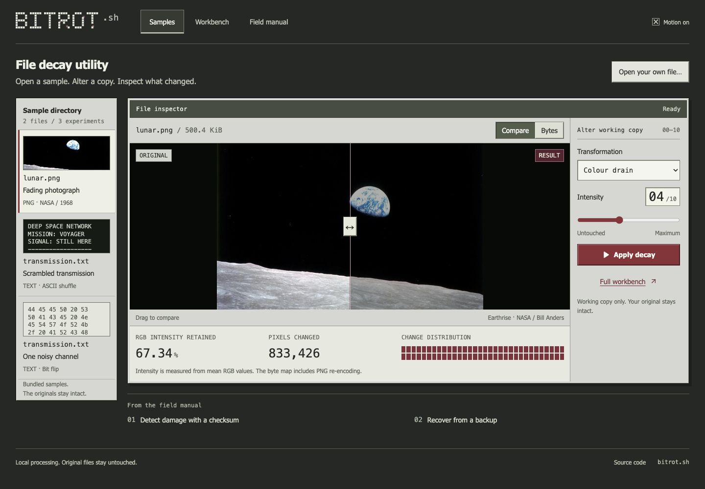
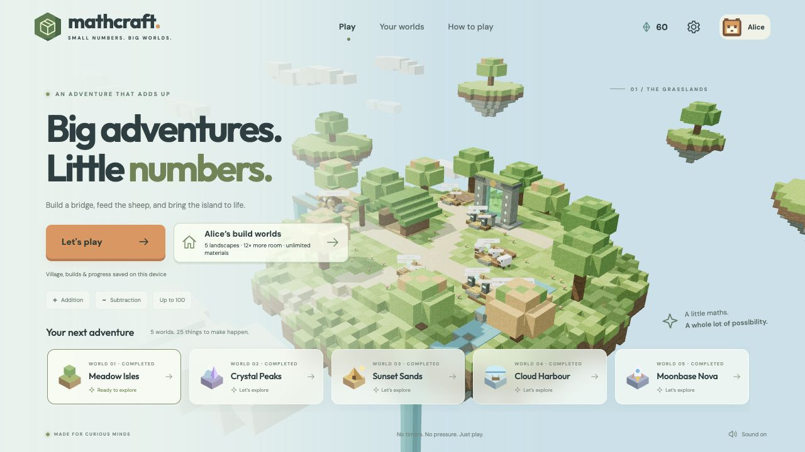

<picture>
  <source media="(max-width: 600px)" srcset="assets/signal-station-mobile.svg">
  <source media="(prefers-color-scheme: dark)" srcset="assets/signal-station-dark.svg">
  <source media="(prefers-color-scheme: light)" srcset="assets/signal-station-light.svg">
  
</picture>

### Selected builds

<table>
  <tr>
    <td width="50%" valign="top">
      
    </td>
    <td width="50%" valign="top">
      <a href="https://github.com/jsaveker/rftui"><picture><source media="(prefers-reduced-motion: reduce)" srcset="assets/rftui.png"></picture></a>
    </td>
  </tr>
  <tr>
    <td width="50%" valign="top">
      <h3><a href="https://github.com/jsaveker/meshtui">MeshTUI</a></h3>
      
A terminal control surface for MeshCore and Meshtastic.

    </td>
    <td width="50%" valign="top">
      <h3><a href="https://github.com/jsaveker/rftui">RFTUI</a></h3>
      
A spectrum and waterfall cockpit for HackRF.

    </td>
  </tr>
  <tr>
    <td width="50%" valign="top">
      
<a href="https://github.com/jsaveker/meshtui">Source</a> &nbsp; · &nbsp; <a href="https://meshtui.com">Explore</a>

    </td>
    <td width="50%" valign="top">
      
<a href="https://github.com/jsaveker/rftui">Source</a> &nbsp; · &nbsp; <a href="https://rftui.com">Explore</a>

    </td>
  </tr>
  <tr>
    <td width="50%" valign="top">
      
    </td>
    <td width="50%" valign="top">
      
    </td>
  </tr>
  <tr>
    <td width="50%" valign="top">
      <h3><a href="https://github.com/jsaveker/bitrot">bitrot</a></h3>
      
A vintage file utility for local data decay, repeatable recipes, and recovery lessons.

    </td>
    <td width="50%" valign="top">
      <h3><a href="https://github.com/jsaveker/Mathcraft">Mathcraft</a></h3>
      
A 3D maths adventure and creative building game.

    </td>
  </tr>
  <tr>
    <td width="50%" valign="top">
      
<a href="https://github.com/jsaveker/bitrot">Source</a> &nbsp; · &nbsp; <a href="https://bitrot.sh">Try it</a>

    </td>
    <td width="50%" valign="top">
      
<a href="https://github.com/jsaveker/Mathcraft">Source</a> &nbsp; · &nbsp; <a href="https://saveker.org/mathcraft/">Play</a>

    </td>
  </tr>
</table>

Real project interfaces. MeshTUI and RFTUI captures use synthetic demo data; the RFTUI preview is animated.

### Behind the station

I'm a security person at **Perpetual Systems**, based in **Austin, TX**. I've spent 20+ years in cybersecurity and risk, from Big 4 consulting to Big Tech to startups. I build detection systems, explore threat graphs, and turn questions into working tools.

Currently exploring **agentic AI in SOC operations**, **graph-based detection**, and **automation**. Away from the keyboard: amateur radio as **N3SAV**, father of twins, and dog dad to **Dumpling**, defender of couches. Fuelled by coffee and curiosity. Famous amongst dozens.

  <a href="https://github.com/jsaveker?tab=repositories"><strong>Projects</strong></a>
  &nbsp; / &nbsp;
  <a href="https://saveker.org"><strong>Website</strong></a>
  &nbsp; / &nbsp;
  <a href="https://saveker.org/cv"><strong>CV</strong></a>
  &nbsp; / &nbsp;
  <a href="mailto:james@saveker.org"><strong>Get in touch</strong></a>

